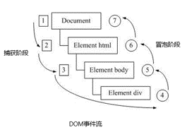
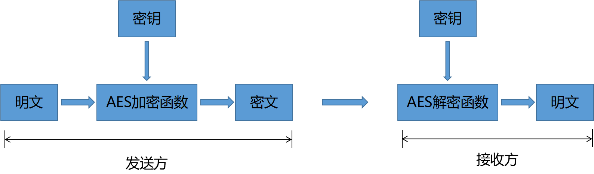
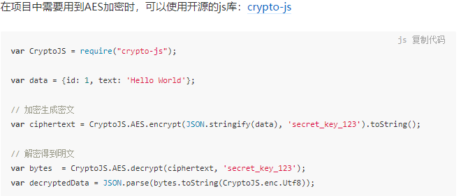
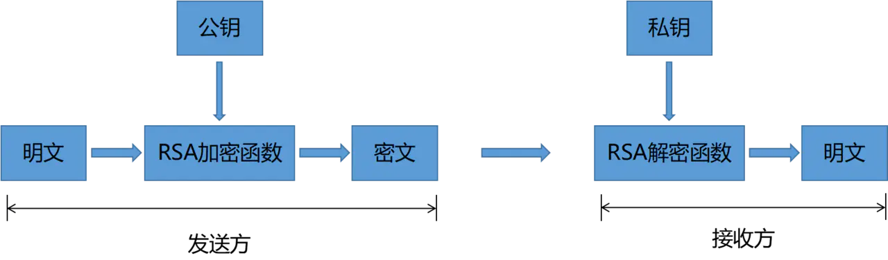
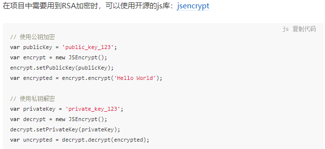
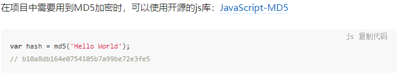
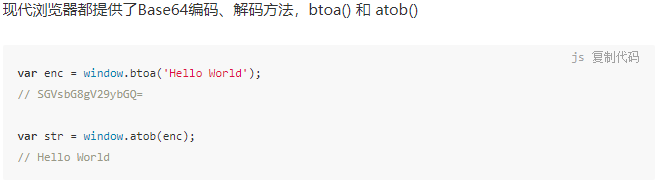
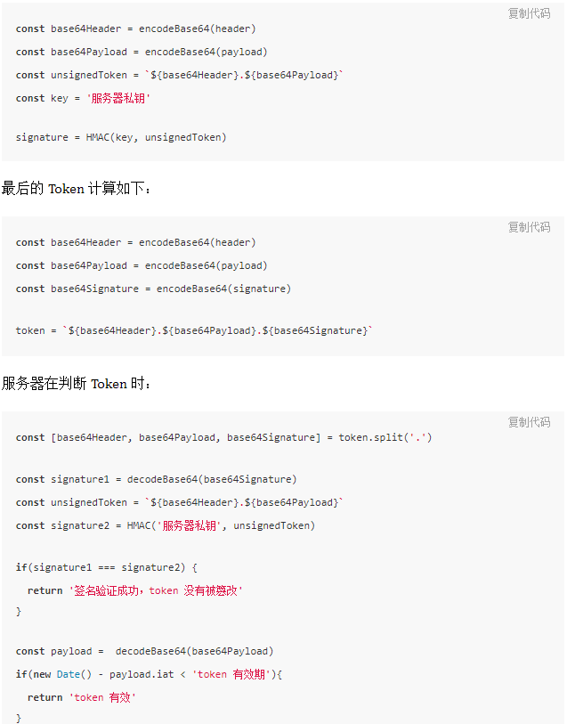

### 数组
- array.splice(index, length, arg) 返回含有被截取的这个值的一个新数组，原数组被改变，第三个参数替换之前的元素
- array.slice(start, end)返回含有被截取元素的数组，不改变原数组
- array.slice()返回数组array的一份拷贝，与原数组在栈中的内存地址不一样
- **数组元素可以看作是数组对象的属性**。JavaScript中以0开头的属性不能用.引用必须用[]获取
- forEach没有返回值强制return也是undefined
- every和some默认返回false
- filter默认返回空数组，否则返回符合条件的元素
- find默认返回undefined，否则返回第一个符合条件的那个元素
- findIndex默认返回-1，否则返回第一个符合条件元素的下标
- map默认返回数组元素为undefined，否则返回一个新的数组不改变原数组
- reduce默认返回undefined
- reduce(callback(accumulator, currentValue, index, array), initialValue)
### call
- 改变this的指向
- 传入参数
- 执行函数
### apply
- 改变this的指向
- 传入参数数组
- 执行函数
### bind
- 改变this的指向
- 返回一个函数
- 可以传入参数
- 柯里化：只传递给函数一部分参数来调用它，让它返回一个函数去调用剩下的参数。
```
    var add = function(x) {
        return function(y) {
            return x + y;
        }
    }
    var increment = add(1);
    var addTen = add(10);

    increment(2);
    // 3

    addTen(2);
    // 12

    add(1)(2);
    // 3
```
### 深浅拷贝原理
- 什么是浅拷贝，这个对象有着原始对象属性值的一份精确拷贝。如果属性是基本类型，拷贝的就是这个基本类型的值，如果属性是引用类型，拷贝的就是内存地址，所以如果其中一个对象改变了这个地址，就会影响到另一个对象。
- 简单的来说浅拷贝解决了第一层的问题，拷贝第一层的基本类型值，以及第一层的引用类型地址。
- 浅拷贝的两份对象不相等，有着不同的内存地址
- 浅拷贝的实现方式有Object.assign()，{...}，slice()
- 深拷贝内存开销大。拷贝前后两个对象互不影响。
- 深拷贝实现方式有JSON.parse(JSON.stringfy())。但是会忽略undefined，symbol，function。循环引用会报错。new Date()转换结果不正确（转换成字符串或者时间戳就行了）。不能正确处理正则
- 浅拷贝就是拷贝第一层的基本类型值，以及第一层引用类型地址
- in遍历对象时，in操作符会检查属性是否在对象及其原型上
- hasOwnProperty只会检查属性是否在当前对象上，不会检查原型链
- typeof 基本类型返回其数据类型
- typeof 引用类型返回不同
  - typeof null // object
  - typeof {} // object
  - typeof [] // object
  - typeof function foo(){} // function
### Object.prototype是浏览器根据ECMAScript规范创造的一个对象
- Object.prototype就是原型链的顶端（不考虑null的情况下）,所有对象继承了toString等方法和属性。
### 高阶函数
- 接受一个或多个函数作为输入/输出一个函数。
- 高阶函数就是一个接收函数作为参数传递或者将函数作为返回值输出的函数。
- JavaScript内置了一些高阶函数forEach，map，some，every，filter
- JavaScript打印函数时会自动调用toString方法
### EventLoop
- 进程是程序运行的一次过程(CPU分配内存的基本单位)
- 线程共享进程所有资源是执行一段指令的过程(CPU调度和分派的基本单位)
- 以Chrome浏览器为例，主要的进程有四个
  - 浏览器进程（Browser Process）：负责浏览器的TAB的前进，后退，地址栏，书签栏的工作和处理浏览器一些不可见的底层操作，比如网络请求文件的访问
  - 渲染进程（Render Process）：负责一个Tab内的显示相关工作，也称渲染引擎
  - 插件进程（Plugin Process）：负责控制网页使用到的插件
  - GPU进程（GPU Process）：负责处理整个应用程序的GPU任务
  - JavaScript引擎线程是工作在渲染进程下的
- JS单线程的好处
  - JS运行的时候可能会阻止UI渲染。JS是可以修改DOM结构的，如果在UI渲染线程工作的时候，就可能导致不能安全的渲染UI
  - 可以节约内存。可以节约上下文切换的时间。异步解决了JS的阻塞。
- JS代码执行分为同步和异步
  - 同步：变量的声明，for循环，赋值操作
  - 异步：setTimeout，setInterval，I/O，UI操作，Promise
    - 异步代码会被加到任务队列中，任务队列分为两种
    - 宏任务队列可以有多个script(同步代码)，setTimeout，setInterval，I/O
    - 微任务只有一个队列异步：Promise.then(), catch(), finally()
    - 浏览器会先执行一个宏任务——再执行当前执行栈产生的微任务——再进行渲染，然后再执行下一个宏任务。宏任务与微任务不在一个任务队列。
    - await前面的代码相当于new Promise的同步代码，await以后的代码相当于Promise.then的异步代码
- JS是单线程的，所有的同步任务都会放在主线程中执行。主线程之外，还有一个任务队列。每当一个异步任务有了结果就会往任务队列里塞一个事件。当主线程中的任务，都执行完成以后，JS引擎会依次读取任务队列里的事件。然后进入主线程开始执行
- JS的单线程就是主线程同步代码在主线程上执行完成以后，执行栈会把异步代码调到主线程执行
### JS运行机制
- CPU可以有很多进程，CPU在运行一个进程的时候其它进程处于非运行的状态，CPU使用**时间片轮转调度算法**来实现同时运行多个进程（为每一个进程都分配一段运行的时间200ms）
- 进程和线程的区别？
  - 进程是操作系统分配资源的最小单位，线程是程序执行的最小单位
  - 进程之间相互独立，互不影响。但同一个进程下的线程共享程序的内存空间（包括代码段，数据集，堆等）
  - 线程上下文的切换要比进程切换快的多
- 浏览器包含哪些进程？
  - 浏览器进程
    - 浏览器的主进程，只有一个。
    - 负责界面的显示，用户交互。前进后退等。
    - 负责各个页面的管理，创建和销毁其它进程。
    - 将渲染进程得到的内存中的Bitmap位图，绘制到用户界面上
    - 网络资源的管理，下载。
  - GPU进程
    - 该进程也只有一个用于3D绘制等等。
  - 插件进程
    - 每种类型的插件对应一个进程，一个插件崩溃了不会影响其它插件的使用，当使用该插件时才会创建该进程。
  - 渲染进程
    - 页面的渲染，JS的执行，事件的循环，都在渲染进程内执行。
    - 渲染进程是多线程的。也就是说某一个线程的运行会影响其它线程的执行
    - GUI渲染线程
      - 负责渲染浏览器界面，解析HTML，CSS，构建DOM树，CSSOM（规则）树，把DOM树和CSSOM树结合生成render（渲染）树
      - 当我们修改元素的颜色或者背景色，页面会发生重绘
      - 当我们修改元素的尺寸，元素的位置，display，就会发生重排
      - 重排比重绘更消耗性能因此我们要尽量避免重绘和重排
      - GUI渲染线程和JS线程是互斥的
        - 当JS引擎执行解析JS代码时，GUI线程会被挂起。
        - GUI的更新会被保存在一个队列中等到JS引擎空闲时立即执行
    - JS引擎线程负责处理JavaScript代码（例如V8引擎）
      -  一个tab页面中无论什么时候都只有一个一个JS线程在运行JS
      -  JS的解析会阻塞GUI线程（在解析HTML遇到script标签GUI的渲染会停止去解析JS。如果解析JS时间过长会造成页面的卡顿）
    - 事件触发线程
      - 负责将准备好的事件交给JS引擎线程执行
      - 属于浏览器而不是JS引擎，用来控制事件循环，并且管理者一个事件队列
      - 当js执行碰到事件绑定和一些异步操作（setTimeout,鼠标点击,ajax异步请求）会走事件触发线程将对应的事件添加到对应的线程中。定时器操作便把定时器事件添加到定时器线程，异步事件有了结果便把他们的回调操作添加到事件队列等待js引擎空闲时来处理
    - 定时器触发线程
      - setInterval与setTimeout所在线程
      - 通过单线程来计时并触发定时（计时完毕后，添加到事件触发线程队列中，等待JS空闲来执行）
      - W3C规定低于4ms的算作4ms
    - 异步http
      - 执行到一个http请求时，就把异步请求事件添加到异步请求线程，等收到响应（http状态变化），再把回调函数添加到事件队列中，等JS引擎线程来执行 
  - EventLoop
    - JS分为同步任务和异步任务。同步任务都在主线程执行（就是JS引擎线程）形成一个执行栈
    - 主线程之外还有一个事件触发线程管理着一个任务队列，只要异步任务有了结果（setTimeout/setInterval时间到0，Promise为resolve，http状态变化）。就会把这些异步任务的回调注册到任务队列中。一旦执行栈中的所有同步任务执行完毕（也就是JS引擎线程空闲了）JS引擎线程会向事件触发线程发起询问，询问事件队列中是否有需要执行的回调函数，如果有将事件队列中的回调事件加入执行栈中，开始执行回调，如果事件队列中没有回调，JS引擎线程会一直发起询问，直到有为止。将任务队列中注册的异步回调添加到执行栈中执行。
    - 定时器触发线程只关注定时不关注结果，定时结束就把回调扔给事件触发线程。
    - 异步http请求线程只关注http请求也不关心结果，http请求状态改变之后，就把回调扔给事件触发线程。
    - 事件触发线程只关心异步回调加入事件队列
    - JS引擎线程只会执行执行栈中的事件，执行栈中的代码执行完毕，就会读取事件队列中的事件并添加执行栈中继续执行，这样循环往复就是Event Loop事件轮询
### 重学ES6
- js有一个顶层对象，它提供全局环境（全局作用域），所有的代码都是在这个环境中执行的。浏览器的顶层对象时window对象，Node指的是global对象
- 暂时死区
  - 时间上暂时无法达到的区域
  - ES6标准指出：let/const声明的变量，当它们包含的词法环境被实例化时（程序的控制流程在新的作用域进行实例化时）它们会被创建（此作用域中的let/const声明的白能量会先在作用域中被创建出来，但因此时还未进行此法绑定，也就是对声明语句进行求值运算，所以是不能被访问的，访问就会抛出错误，所以在变量进入作用域它们的词法环境被实例化，但是变量还没求值，所以这段时间内不能访问），但只有在变量的词法绑定已经被求值运算后，才能够被访问。
  - 箭头函数的this来自上下文的词法环境（上层this），call，bind，apply也无法改变。箭头函数不能作为构造函数
  - Promsie解决了什么？回调地狱，第三方库的回调函数不确定回调的结果/错误的结果交给第三方库处理不信任
  - Promise是一个状态机初始状态时pending变为fulfilled或rejected。必须有Promise实例主动调用then把结果从Promise中取出来，调用catch把错误的结果取出来。这样主动权就回到了开发者手上
  - ES6 Module使用import导入模块，export导出模块
    - ES6 Module是静态的，编译阶段运行，和var和function一样具有提升效果（这个特点使得它支持tree shaking）
    - 自动采用严格模式（顶层的this返回undefined）
- 数据类型
  - Undefined
    - undefined
  - Null
    - null
  - String
  - Number
  - Boolean
    - true/false
  - Object(包含Array、Function、Date、RegExp、Error)
  - Symbol
### DOM事件流之事件捕获以及事件冒泡
- DOM事件流
  - dom事件流分为三个阶段：
  - 1 捕获阶段
  - 2 当前目标阶段
  - 3 冒泡阶段
  - 比如我们给一个div注册了点击事件，则DOM事件流图
  - 1-4是捕获阶段，4是当前目标阶段，4-7是冒泡阶段
  - 在事件捕获概念下发生click事件的顺序应该是：document -> html -> body -> 目标元素
  - 事件执行都是从最顶层的元素开始的
  - 与事件捕获相反的则是事件冒泡，事件执行都是从最底层的元素开始的。
  - 一般情况下不标明事件冒泡还是事件捕获的话，默认都是按事件冒泡来处理。既有捕获又有冒泡的话先捕获再冒泡
### 前端加密算法
- 目前常见的加密算法可以分为三类
  - 对称加密算法：AES
    - 对称加密指的是加密和解密使用相同密钥的加密算法。它要求发送发和接收方在安全通信之前，商定一个密钥。对称算法的安全性依赖于密钥，泄露密钥意味着任何人都可以对他们发送的消息进行加密与解密
    - 特点：算法公开，计算量小，加密速度快
    - 缺点：密钥一旦泄露，加密信息相当于明文了
    - 使用场景：https通信，网络传输
    - AES是最常见的对称加密算法
    - 
    - 
  - 非对称加密算法：RSA
    - 非对称加密算法需要两个密钥：公开密钥（publickey:公钥）和私有密钥（privatekey:私钥）。公钥与私钥是一对，如果公钥对数据进行加密，只有用对应的私钥才能解密。因为加密和解密使用的是两个不同的密钥，所以也被称作非对称加密算法。
    - 特点：非对称加密与对称加密相比其安全性更好
    - 缺点：加密和解密花费时间长，速度慢，只适合少量数据进行加密
    - 使用场景：https会话前期，CA数字证书，信息加密，登录认证
    - RSA加密算法是非对称加密算法最常见的一种
    - 
    - 
  - Hash算法：MD5
    - Hash：就是把任意长度的输入通过散列算法变换成固定长度的输出，该输出就是哈希值。这种转换是一种压缩映射，散列值的空间通常远小于输入的空间，不同的输入可能会散列成相同的输出，而不能从散列值来唯一的确定输入值
    - 特点：不可逆，易计算，特征化
    - 缺点：可能存在散列冲突
    - 使用场景：文件或字符串一致性校验，数字签名，鉴权协议
    - MD5是比较常见的Hash算法(SHA1,SHA256,SHA384)
    - 
  - Base64编码
    - Base64编码只是一种编码格式并不是加密算法，它可用于在HTTP环境下传递较长的标识信息。
    - 特点：可以将任意的二进制数据进行Base64编码
    - 数据加密之后，数据量会变大，变大1/3左右
    - 编码的结果末尾有个=号
    - 可以解码
    - 
  - JWT算法主要分为3个部分：header(头部信息)，payload(消息体)，signature(签名) 
    - header部分指定了该JWT使用的签名算法：header = '{"alg":"HS256","type":"JWT"}'
    - payload部分声明了token的iss(签发者)，sub(所面向的用户)，exp(过期时间)和自定义的数据
    - signature部分为jwt的签名，主要为了让jwt不能随意篡改
    - 