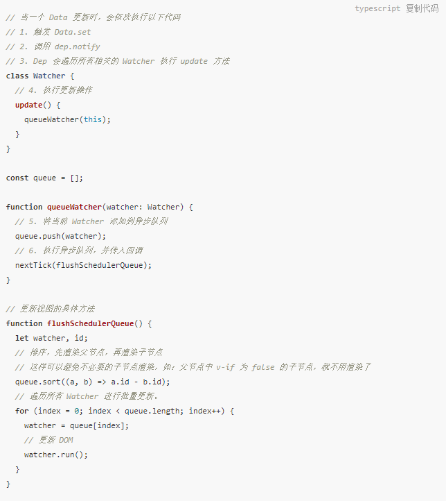
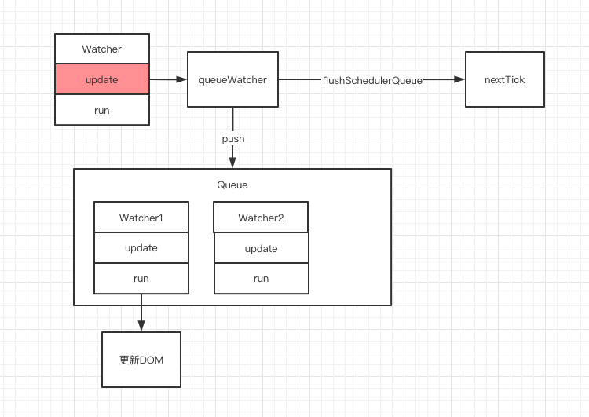
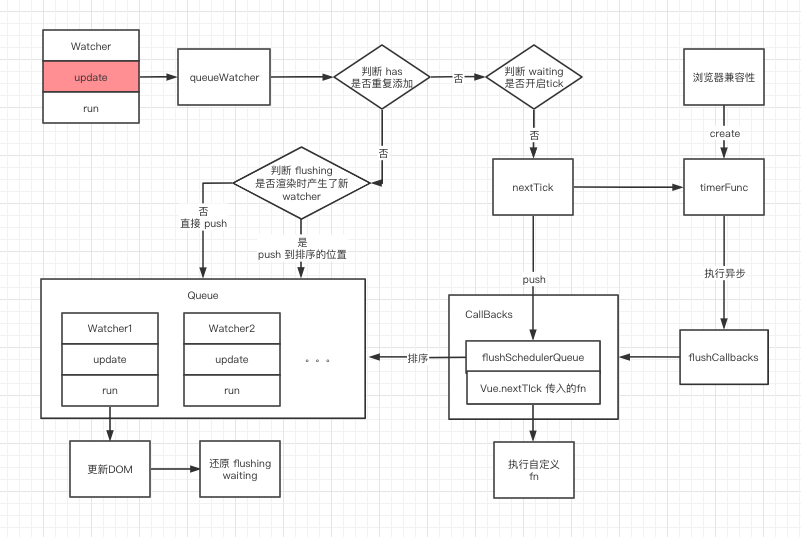

# Vue原理分析
### Vue执行流程分析
```
// 单文件组件中常见代码
export default {
  data () {
    return {
      msg: 'click me'
    }
  },
  methods: {
    say () {
      this.msg = 'well done'
    }
  }
}
```
```
// 入口文件中的常见代码
new Vue({
  el: '#app',
  router: router,
  render: h => h(App)
})
```
#### 初始化
```
// Vue构造函数
function Vue (options) {
  function Vue (options) {
    if (!(this instanceof Vue)
    ) {
      warn('Vue is a constructor and should be called with the `new` keyword');
    }
    // 执行初始化逻辑
    this._init(options);
  }
}
```
- 从Vue的构造函数可以看出，当我们new Vue的时候，只执行了一个_init的方法。_init方法会根据传入的选项对vue进行初始化。props，data，生命周期，事件机制的初始化都是在此过程中完成的。
- 以data的初始化为例，vue会通过Object.defineProperty的方式将data的属性定义到vue实例上。这也就解释了为什么我们可以在vue中通过对this.msg进行赋值，可以修改data中属性的值。
- 以上对data的处理只是刚刚开始。为了能实现所谓的响应式或者数据驱动更新，vue又做了进一步的处理，创建一个observer对象，该对象与data绑定，通过Object.defineProperty将data中的所有的属性转换为getter/setter。访问器属性在对象字面量中。它们用get和set表示。
```
let obj = {
  get propName() {
    // 当读取 obj.propName 时，getter 起作用
    // 执行Dep收集依赖，也就是收集Watcher
  },

  set propName(value) {
    // 当执行 obj.propName = value 操作时，setter 起作用
  }
};
```
- Vue中用Observer类来管理上述响应式化Object.defineProperty的过程。可以用如下代码来描述，将Vue实例中的data属性全部进行响应式绑定
```
class Observer {
    constructor() {
        // 响应式绑定数据通过方法
    	observe(this.data);
    }
}

export function observe (data) {
    const keys = Object.keys(data);
    for (let i = 0; i < keys.length; i++) {
       // 将data中我们定义的每个属性进行响应式绑定
       defineReactive(obj, keys[i]);
    }
}
```
- 简单的来说Observer就是管理data中的属性实现响应式的过程
- 当data中的属性在vue实例中被访问（会触发getter），observer对象就会把该属性收集为watcher实例的依赖，之后当data中的属性在vue实例中被改变（会触发setter），observer会通知依赖该属性的watcher实例重新渲染页面
- 一个属性可能有多个依赖，每个响应式数据都一个Dep来管理依赖这个属性的数据（管理它的依赖）
- 如何收集依赖？
- 我们如何知道data中的某个属性被使用了，答案就是Object.defineProperty，因为读取某个属性就会触发get方法。
- 什么是依赖？
- Watcher就是类似中介的角色，比如message就有三个中介，当message变化，就通知这三个中介，他们就去执行各自需要做的变化。
- Watcher能够控制自己属于哪个，是data中的属性watch还是computed，Watcher自己有同意的更新入口，只要你通知它，就会执行对应的更新方法。
- 所以Watcher必须要有两个方法。一个就是通知变化，另一个就是被收集起来到Dep中去
```
class Watcher {
    addDep() {
        // 我这个Watcher要被塞到Dep里去了~~
    },
    update() {
        // Dep通知我更新呢~~
    }, 
}
```
#### 模板解析
- 数据的更新会触发页面的重新渲染。
- 首先vue会把我们编写的HTML模板解析成一个AST描述对象（抽象语法树），该对象就是通过children和parent链接而成的属性结构，完整的描述了HTML标签的所有信息。
```
<div id="app">
    <p>{{msg}}</p>
</div>
```
```
{
   attrs: [{name: "id", value: ""app"", dynamic: undefined, start: 5, end: 13}],
   attrsList: [{name: "id", value: "app", start: 5, end: 13}],
   attrsMap: {id: "app"},
   children: [{
        attrsList: [],
        attrsMap: {},
        children: [],
        end: 33,
        parent: {type: 1, tag: "div", ...},
        plain: true,
        pre: undefined,
        rawAttrsMap:{},
        start: 19
        tag: "p",
        type: 1
   }],
   end: 263,
   parent: undefined,
   plain: false,
   rawAttrsMap:{id: {name: "id", value: "app", start: 5, end: 13}},
   start: 0
   tag: "div",
   type: 1
}
```
- 然后vue根据AST对象生成render函数
```
with(this){
    return _c('div', {attrs:{"id":"app"}}, [_c('p', [_v(_s(msg))])])
}
```
- 也就是说，我们的模板最终在vue内部都是会以一个render函数的形式存在。
#### 先虚后实
- 得到render函数以后，vue并未直接渲染成DOM树，二十先通过render函数得到一个vnode。实际上这一步是非常必要的，我们都知道频繁大量的操作DOM节点是级耗性能的。vue在渲染之前通过对vnode的比较，可以大大规避非必要的DOM操作。
```
{
    tag: "div",
    children: [{tag: "p", ...}],
    data: {attrs: {id: "app"}}
    elm: DOM节点（div#app）,
    parent: undefined,
    context: Vue实例,
    ...
}
```
- 将真实的DOM节点使用一个JS对象去表示，这个JS独享就可以被称为虚拟DOM。
```
<div id="app" >
    <h3>内容</h3>
    <ul class="list">
        <li>选项一</li>
        <li>选项二</li>
    </ul>
</div>
```
- 转化为虚拟DOM
```
vdom = {
    type: 'div',  // 节点的类型,也就是节点的标签名
    props: {      // 节点设置的所有属性
        'id': 'content'
    },
    children: [   // 当前节点的子节点
        {
            type: 'h3',
            props: '',
            children:['内容']
        },
        {
            type: 'ul',
            props: {
                'class': 'list'
            },
            children: {
                {
                    type: 'li',
                    props: '',
                    children: ['选项一']
                },
                {
                    type: 'li',
                    props: '',
                    children: ['选项二']
                }
            }
        }
    ]
}
```
#### 将虚拟DOM转化为真实节点
- 虚拟DOM最基本的三个属性就是：标签属性，标签元素的属性，标签元素的子节点。所以说当两个虚拟DOM对象进行一个差异比较时，比较的也就是这三个属性。
- 虚拟DOM它实际就是存储在内存中的一个数据，那终极目标是需要将这个数据转化为真实的DOM节点展示到浏览器上
```
根据type属性创建节点 
设置节点属性  
处理子节点：根据子节点的type创建子节点、设置子节点属性，添加子节点到父节点中
```
#### dom-diff算法
- dom-diff算法做的事情就是比较之前旧的虚拟DOM和当前新的DOM两者之间的差异，然后将这部分差异（patches）的内容更新到文档中。
- dom-diff算法的核心就是对虚拟DOM节点进行深度优先遍历并对每一个虚拟DOM节点进行编号，在便利的过程中对同一个层级的节点进行比较，最终得到比较后的差异：patche。
- dom-diff在比较差异时只会对同一层级的节点进行比较，因为如果完全比较，算法实际复杂度会过高，所以舍弃了这种完全比较的方式，而采用同层比较。

#### Observer(响应式)——Dep(依赖管理)——Watcher(中介)
- defineReactive实现数据的响应式
```
function defineReactive (obj, key, val) {
    Object.defineProperty(obj, key, {
        enumerable: true,
        configurable: true,
        get: () => {
            console.log('我被读了，我要不要做点什么好?');
            return val;
        },
        set: newVal => {
            if (val === newVal) {
                return;
            }
            val = newVal;
            console.log("数据被改变了，我要把新的值渲染到页面上去!");
        }
    })
}

let data = {
    text: 'hello world',
};

// 对data上的text属性进行绑定
defineReactive(data, 'text', data.text);

console.log(data.text); // 控制台输出 <我被读了，我要不要做点什么好?>
data.text = 'hello Vue'; // 控制台输出 <hello Vue && 数据被改变了，我要把新的值渲染到页面上去!>
```
- vue中用Observer类来管理上述响应式变化Object.defineProperty的过程。
```
class Observer {
    constructor() {
        // 响应式绑定数据通过方法
    	observe(this.data);
    }
}

export function observe (data) {
    const keys = Object.keys(data);
    for (let i = 0; i < keys.length; i++) {
       // 将data中我们定义的每个属性进行响应式绑定
       defineReactive(obj, keys[i]);
    }
}
```
- 我们通过defineReactive方法将data中的数据进行响应式后，虽然可以监听到数据的变化了，怎么处理通知试图更新？
- Dep就是帮我们收集依赖（究竟要通知到哪里）。在视图中展示的数据都会被Dep收集为依赖。message的Dep就收集到了一个依赖，这个依赖就是用来管理data中dmessage变化的。
```
<div>
    <p>{{message}}</p>
</div>
```
```
data: {
    text: 'hello world',
    message: 'hello vue',
}
```
- 当使用watch属性时，自定义的监听某个data中属性的变化，比如监听message的变化，message变化时我们要通知到watch这个狗子，让它去执行回调函数。
- 这个时候message的Dep就收集到了两个依赖，第二个依赖就是用来管理watch中message变化的。
```
watch: {
    message: function (val, oldVal) {
        console.log('new: %s, old: %s', val, oldVal)
    },
}        
```
- 自定义computed属性时，如下messageT属性，是依赖message的变化的。因此message变化时要通知到computed，让它去执行回调函数。这个时候message的Dep就收集到了三个依赖，这个依赖就是用来管理computed中message变化的。
```
computed: {
    messageT() {
        return this.message + '!';
    }
}
```
- 一个属性可能有多个依赖，每个响应式数据都有一个Dep来管理它的依赖
- 如何收集依赖
- 如何收集依赖
- Object.defineProperty读取某个属性就会触发get方法
```
function defineReactive (obj, key, val) {
    let Dep; // 依赖

    Object.defineProperty(obj, key, {
        enumerable: true,
        configurable: true,
        get: () => {
            console.log('我被读了，我要不要做点什么好?');
            // 被读取了，将这个依赖收集起来
            Dep.depend(); // 本次新增
            return val;
        },
        set: newVal => {
            if (val === newVal) {
                return;
            }
            val = newVal;
            // 被改变了，通知依赖去更新
            Dep.notify(); // 本次新增
            console.log("数据被改变了，我要把新的值渲染到页面上去!");
        }
    })
}
```
- watcher就是类似中介的角色，比如message就有三个中介，当message（租房需求）变化时，就通知这三个中介，让它们去执行各自的变化。
- watcher能够控制自己属于哪个，是data中的属性还是watch，或者说时computed，watcher自己有统一的更新入口，只要你通知它，就会执行对应的更新方法。
- 因此可以推断出Watcher必定有两个方法。一个是通知变化，另一个就是被收集起来到Dep中去。
```
class Watcher {
    addDep() {
        // 我这个Watcher要被塞到Dep里去了~~
    },
    update() {
        // Dep通知我更新呢~~
    }, 
}
```
### Vue异步更新
- 
- 
- 
- Vue在调用Watcher更新视图时，并不会直接进行更新，而是把需要更新的Watcher加入到Queue队列里，然后把具体的更新方法flushSchedulerQueue传给nextTick进行调用