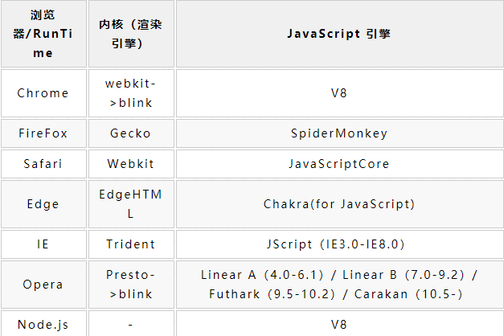
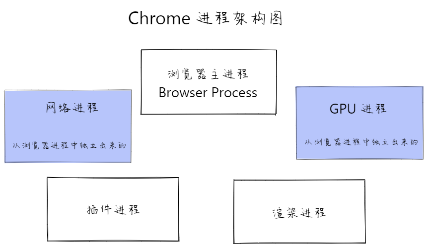
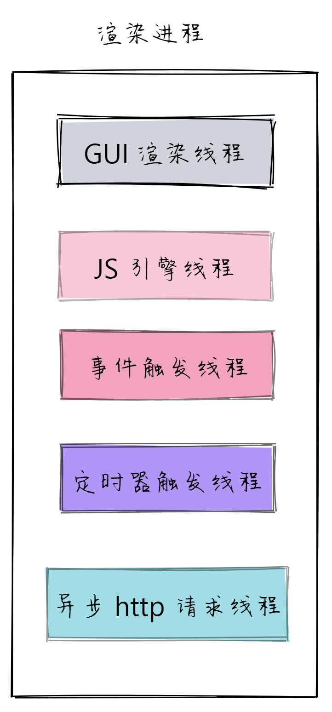
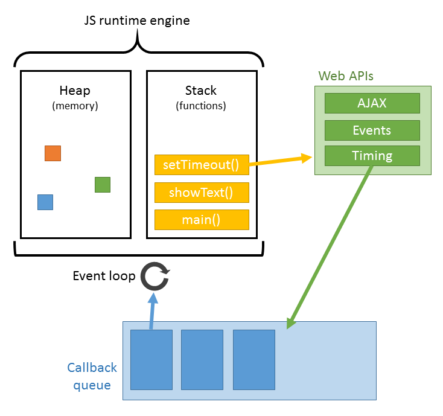
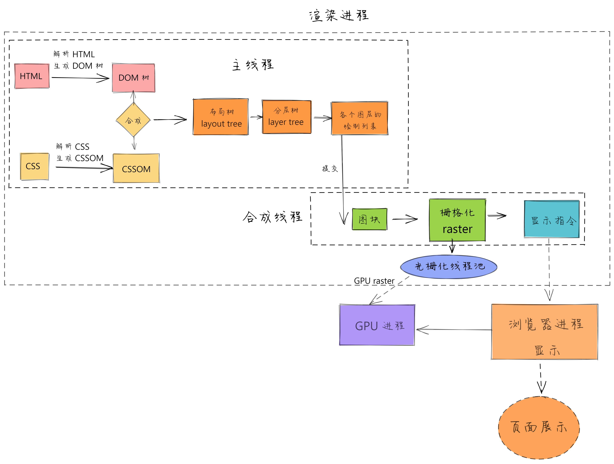
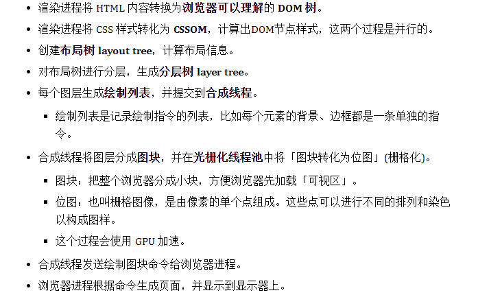
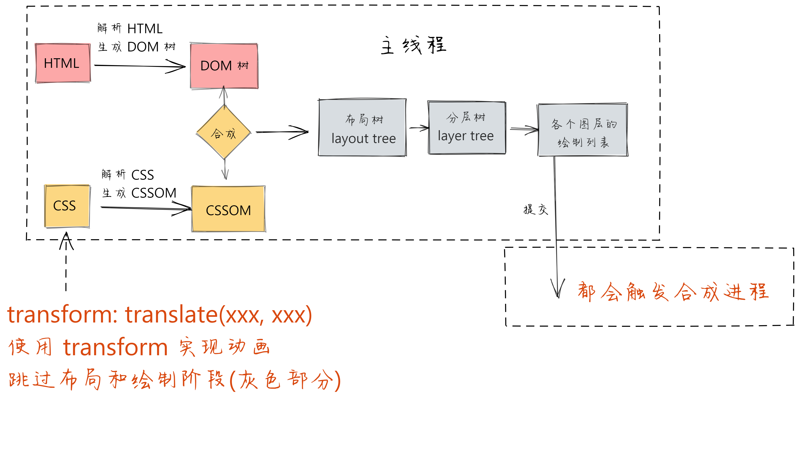
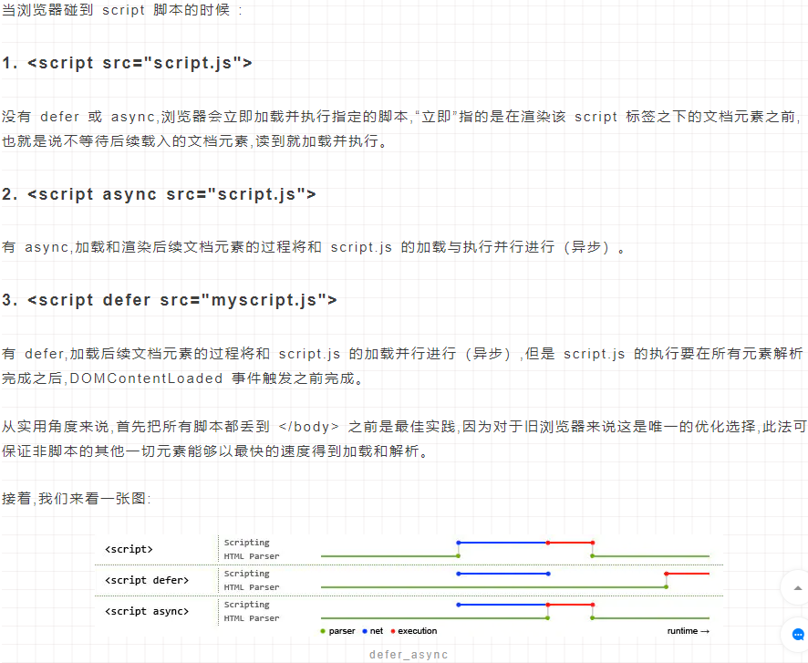

### 重排(reflow)和重绘(repaint)
- 页面生成的过程
  - 1 HTML解析器解析HTML生成DOM树
  - 2 CSS解析器解析CSS生成CSSOM(规则树)
    - 2.1 HTML的解析和CSS的解析是并行的
  - 3 DOM树和CSSOM树生成一个渲染树(Render Tree)
  - 4 生成布局(flow)，浏览器在页面上画出渲染树的所有节点
  - 5 将布局绘制(paint)在屏幕上，显示出整个页面
  - 第四步和第五步是最耗时的这两步合起来就是渲染
- 第一次生成页面的时候至少会发生一次排列和绘制
  - 在以后的操作中(来自用户的操作)可能会发生很多次的重绘和重排
  - 发生重排的情况：
    - 1 总的来说就是元素的增删改，其次是元素的位置大小边距，文字的数量大小，浏览器窗口的大小
    - 2 页面初始渲染，这是开销最大的一次(html里面执行js然后操作dom影响布局)
  - 发生重绘的情况:
    - 1 元素的外观发生改变，但布局并没有改变，重新把元素外观绘制出来的过程
    - 2 color，background-color，border-color，text-decoration，outline
### 正向代理与反向代理
- 正向代理
  - 有一个客户端要向一个非同源的服务器serverB发送请求，搭建一个与客户端同源的夫服务器serverA，当客户端发送请求的时候，由serverA来接受，再由serverA向serverB发送请求，因为同源策略是浏览器给的，服务器之间没有。serverB接收到请求后会处理请求，并把响应返回给serverA，再由serverA把响应返回给客户端。
- 反向代理
  - 反向代理是用来做负载均衡的，当我们请求一个服务器的时候，其实请求的是服务器端设置的代理服务器。代理服务器把大量的请求分给不同的服务器进行处理，再由服务器把响应返回给代理服务器，代理服务器再返回给客户端。
### 浏览器18问
- 常见的浏览器内核有哪些?

- 浏览器的主要组成部分是什么？
  - 
  - 1个浏览器主进程
    - 负责界面显示，用户交互，各个页面的管理，子进程的管理，网络资源的管理，下载等。
  - 1个GPU进程
    - 3D，Chrome UI绘制
  - 1个网络进程
    - 负责网络资源加载。之前是作为一个模块运行在浏览器进程里面的，后来才成为一个单独的进程。
  - 多个插件进程（一个插件对应一个进程）
    - 负责插件的运行，因插件易崩溃，所以需要通过插件进程进行隔离保证插件进程崩溃不会对浏览器和页面造成影响。
  - 多个渲染进程（称为浏览器内核一个页面对应一个进程）
    - 
    - 渲染进程和插件进程都运行在沙箱中
    - 页面的渲染，JS的执行，事件的循环，这些都是在渲染进程内执行
    - GUI渲染线程
      - 负责渲染浏览器揭秘那，解析HTML，CSS，构建DOM树和Render树，布局和绘制等等
    - JavaScript引擎线程（也被称为JS内核，V8）
      - JS引擎一直等待任务队列中任务的到来，然后加以处理，一个tab页面无论什么时候都只有一个JS线程在运行JS程序
    - 事件触发线程
      - JS事件触发线程管理着一个任务队列（这是浏览器开启的一个线程帮助JS引擎来执行JS代码的）
      - 任务队列里的任务都是异步的（setTimeout, setInterval, Promise.resolve, Promise.reject等等）这些异步任务一旦有了结果就会被添加到任务队列的队尾，排队等待JS引擎来执行
      - 由于JS引擎是单线程处理JS代码的，所以任务队列的任务会等待JS引擎空闲时去执行
    - 定时器触发线程
      - W3C规定setTimeout定时小于4ms的话按照4ms计算
    - 异步HTTP请求线程
      - HTTP请求发起后，会请求浏览器开启一个线程。
      - HTTP请求的状态发生改变以后，如果有回调函数的话，回调函数被加入任务队列队尾。
    - 栈为主线程提供代码执行环境。主线程中的代码执行完毕以后（执行栈为空），会向任务队列发起询问，询问事件触发线程的事件队列中是否有需要执行的回调函数，如果有的话就出队列进入主线程开始执行，如果没有主线程就会一直发起询问，直到有为止。
    - 定时触发线程只关心定时结果不关注定时结束的回调，定时结束就把回调扔给事件触发线程进入任务队列。
    - 异步HTTP线程也是只关心请求不关心请求的结果，请求完成以后就把结果扔给事件触发线程进入任务队列。
    - 事件触发线程只关心异步回调进入任务队列，不关心如何执行这些异步任务。
    - JS主线程只关心如何执行JS任务，不关注入队列。
- 为什么JavaScript是单线程的，与异步冲突吗？
  - 假设js支持多线程操作的话，js可以操作dom，那么一个线程在删除dom，另一个线程在获取dom就会乱掉了
- CSS加载会造成阻塞吗？
  - CSS不会阻塞DOM解析，但会阻塞DOM渲染
  - CSS会阻塞JS执行，并不会阻塞JS文件下载
  - CSSOM（规则树）
    - 提供给JavaScript操作样式表的能力
    - 为布局树的合成提供基础的样式信息
  - DOM和CSSOM通常是并行构建的，所以**CSS加载不会阻塞DOM解析**
  - 然而由于Render Tree是依赖DOM Tree和CSSOM Tree的所以它必须等到两者都加载完毕后，完成各自的构建才会开始渲染，因此**CSS加载会阻塞DOM的渲染**
  - 由于JavaScript是可操作DOM和CSS样式的，如果在修改这些元素属性的同时渲染揭秘那（即JavaScript线程和GUI渲染线程同时运行），那么渲染线程前后获得的元素数据就可能不一致了。所以才设置看JavaScript引擎线程与GUI渲染线程是互斥的
  - 当JavaScript引擎执行时GUI线程会被挂起，GUI更新会被保存在一个队列中等到引擎线程空闲时立即被执行。
  - 如果js执行的时间过长，就会造成GUI渲染线程长时间被挂起迟迟不能渲染造成用户视觉上渲染不连贯的现象
  - 有时候JS需要等待CSS的下载
    - 如果脚本的内容是获取元素的样式，宽度和高度浏览器是需要计算的也就是依赖于css。六拉你去也无法感知脚本内容到底是什么，为避免样式获取，因而只好等前面的样式下载完后，再执行JS
    - JS文件的下载和CSS文件下载是并行的，有时候CSS文件很大，所以js需要等待
- 为什么JS会阻塞页面加载？
  - js阻塞dom解析，也就会阻塞页面
  - 这也是为什么说JS文件放在最下面的原因，那为什么会阻塞DOM解析呢
  - 如果JavaScript文件中没有操作DOM相关代码，就可以将该JavaScript代码设置为异步加载通过async或defer来标记代码
- defer和async的区别？
  - 两者都是异步去加载外部JS文件，不会阻塞DOM解析
    - async时在外部JS加载完成后，浏览器空闲时，Load事件触发之前执行，标记为async的脚本在加载完成后就执行无论此刻是HTML解析阶段还是DOMContentLoaded触发之后，该属性对于内联脚本无用（即没有「src」属性的脚本） 
    - defer是在JS加载完成后，整个文档解析完成后，触发DOMContentLoaded事件前执行，同样的不会对内联脚本起作用
    - defer的加载和DOM的解析是并行的，不会影响DOM的解析，整个document解析完毕且defer-script也加载完成之后，会执行所有defer的JavaScript代码然后触发DOMContentLoaded
  - DOMContentLoaded 与 load 的区别 ?
    - 当DOMContentLoaded事件触发时，仅当DOM解析完成后，不包括样式表，图片等资源。文档中没有JS时，浏览器解析完文档便能触发DOMContentLoaded事件。如果有JS则会则会阻塞DOM解析，而脚本需要等CSSOM构建完才执行。在任何情况下DOMContentLoaded的触发都不需要等待图片等其它资源加载完成
    - 当 onload 事件触发时,页面上所有的 DOM,样式表,脚本,图片等资源已经加载完毕
    - DOMContentLoaded 》 load
- 为什么CSS动画比JavaScript高效
  - 尽可能的避免重排与重绘，如果非要操作JS实现动画的话优化手段
    - 使用createDocumentFragment进行批量的 DOM 操作
    - 对于 resize、scroll 等进行防抖/节流处理。
    - rAF(requestAnimationFrame)优化等等
      - 动画帧率可以作为衡量标准，一般来说画面在 60fps 的帧率下效果比较好。
      - 换算一下就是，每一帧要在 16.7ms (16.7 = 1000/60) 内完成渲染。
      - 系统每次绘制之前会主动调用rAF中的回调函数，如果系统的绘制率是60Hz，那么回调函数就梅16.7ms被执行一次，如果绘制率是75Hz纳么这个间隔时间就变成了1000/75=13.3ms
      - rAF的执行不发跟着系统的绘制频率走。它能保证回调函数在屏幕每一次的绘制间隔中只被执行一次（有点节流的意思），这样就不会引起丢帧现响，也不会导致动画出现卡顿的问题。
      - rAF在浏览器决定渲染之前给你最后一个机会去改变DOM属性，然后很快在接下来的绘制中帮你呈现出来，所以这是做流畅动画的不二选择
      - 与throttle对比dom.throttle(doSomething，16)等价。
      - 只要涉及到重新计算元素位置，就可以使用它。
- 为什么setTimeout不准时？
  - 因为JavaScript是一个单线程，因此一段时间内只能执行一段JS代码。为了控制JS的执行顺序就有了一个事件队列，事件队列里保存执行的任务。这些任务会按照呀它们添加到队列的顺序执行。setTimeout()第二个参数告诉JS再过多长时间把档期那任务添加到队列中。如果队列是空的，那么代码会立即执行，如果队列不是空的，那么它就要等到前面的代码都执行完了以后再执行。所以setTimeout是否准时要看它钱前面有没有任务。
  - 
  - 当执行到一个http请求时，就把这个事件添加到http线程。等到http状态变化时，再把回调函数添加到事件队列，等待js引擎线程来执行
- 能不能实现图片的懒加载？
- 说一说从输入URL到页面呈现发生了什么？
  - https://juejin.im为例
  - 1 构建请求
    - 首先浏览器构建请求行信息，构建好后，浏览器准备发起网络请求
    - `GET / HTTP1.1 GET是请求方法，路径就是根路径，HTTP协议版本1.1`
  - 2 查找缓存
    - 在真正发起网络请求之前，浏览器会先在浏览器中查询是否有要请求的文件。先检查强缓存，如果命中的话直接使用，否则进入下一步
  - 3 DNS解析
    - 输入域名的话，我们要根据域名去获取对应的IP地址。这个过程需要依赖一个服务系统叫做DNS域名解析，从查找到获取具体的IP的过程焦作市DNS解析
    - 首先浏览器提供了DNS数据缓存功能，如果一个域名已经解析过了，纳么就会把解析的结果缓存下载，下次查找的就话，直接从缓存中找不需要经过DNS解析
    - 3.1 首先查看是否有对应的域名缓存，有的话直接使用缓存的IP访问
      - `ipconfig /displaydns // 输入这个命令就可以查看对应的电脑中是否有缓存`
    - 3.2 如果缓存中没有，则去查找hosts文件
      - `c:\windows\system32\drivers\etc\hosts` 
    - 3.3 如果hosts文件里没找到想解析的域名，则将域名法网自己设置的DNS服务器（也叫本地DNS服务器）
      - `ipconfig/all 通过这个命令可以查看自己的本地dns服务器` 
    - 3.4 如果本地DNS服务器有响应域名的记录，则返回记录
      - `电脑的dns服务器一般是各大运营商如电信联通提供的，或者像180.76.76.76，223.5.5.5，4个114等知名dns服务商提供的，本身缓存了大量的常见域名的ip，所以常见的网站，都是有记录的。不需要找根服务器。` 
    - 3.5 如果本地DNS服务器没有记录，回去找根服务器。根服务器全球只有13组，会去找其中之一，找到根服务器后，根服务器会根据请求的域名，返回对应的顶级域名服务器
      - `如果请求的域名是xxx.com，则返回负责com域的服务器`
      - `如果是xxx.cn，则发给负责cn域的服务器`
      - `如果是xxx.ca，则发给负责ca域的服务器`
    - 3.6 顶级域名服务器收到请求，会返回二级域名服务器的地址
      - 比如一个网址是www.xxx.edu.cn，则顶级域名服务器再转发给负责.edu.cn域的二级服务器
    - 3.7 以此类推，最终会转发到负责锁查询域名的，最精确的那台DNS，可以得到查询结果
    - 3.8 最后一步，本地DNS服务器，把最终的解析结果，返回给客户端，对客户端来讲，只是一去一回的事，客户端并不知道DNS服务器经过了千山万水 
  - 4 建立TCP连接
    - 通过三次握手建立客户端与服务器之间的连接
    - 进行数据传输
    - 断开连接的阶段。数据传输完成，现在要断开来凝结了，通过四次挥手来断开连接
    - TCP连接通过什么手段来保证数据传输的可靠性，一是三次握手确认连接，二是数据包校验保证数据到达接收方，三是通过四次挥手断开连接。
  - 5 发送HTTP请求
    - TCP连接完成后，接下来就可以与服务器通信了，发送HTTP请求的话，需要携带三样东西：**请求行，请求头，请求体**
    - 跟请求部分类似，网络相应具有三个部分：**响应行，响应头，响应体**
    - 收到响应后连接是否断开取决于Connection: close/Keep-Alive。持久连接之后请求统一站点的资源会复用这个连接
  - 6 渲染阶段
    - 
    - 
    - 6.1 构建DOM树
    - 6.2 样式计算
    - 6.3 布局阶段
    - 6.4 分层
    - 6.5 绘制
    - 6.6 分块
    - 重排比重绘更消耗性能
      - 重排：浏览器会触发重新布局，解析之后的一系列子阶段。重排需要更新完整 的渲染流水线，所以开销也是最大的
      - 重绘：修改了元素的背景颜色，那么布局阶段将不会被执行，因为并没有引起几何位置的变换。所以就直接进入了绘制阶段，然后执行之后的一系列子阶段。
      - 和重排相比，重绘省去了布局和分层阶段，所以执行效率比重排操作要高一点。
      - 合成：渲染引擎跳过布局和绘制，直接执行后续的合成操作，我们把这个过程叫做合成。
        - 
        - CSS3的transform，opacity，filter这些属性会触发合成。合成的效率是最高的：
        - 避开重排和重绘阶段，直接在非主线程上执行合成动画操作
        - 充分发挥GPU优势。生成位图的过程中会调用线程池，并在其中使用GPU进行加速生成
        - 因为没有占用主线程的资源，所以即使主线程卡住了，页面依然流畅展示。
- XSS
  - XSS是指黑客往HTML文件中或者DOM中注入恶意脚本，从而在用户浏览页面时利用注入的恶意脚本对用户实施攻击的一种手段
    - 窃取Cookie
    - 监听用户行为，比如输入账号密码后发给黑客服务器
    - 在网页中生成浮窗广告
    - 修改DOM伪造登录表单
  - 预防XSS攻击
  - 对输入的脚本进行转码
  - HttpOnly
- CSRF
  - 黑客引诱用户打开黑客的网站，在黑客的网站中，利用用户的登录状态发起的跨站请求
  - CSRF攻击就是黑客利用了用户的登录状态，并通过第三方的站点来做一些坏事
    - 自动发起Get请求 
    - ` `
    - 自动发起POST请求
    - `<form action="http://bank.example/withdraw" method=POST>
          <input type="hidden" name="account" value="xiaoming" />
          <input type="hidden" name="amount" value="10000" />
          <input type="hidden" name="for" value="hacker" />
        </form>
        `
    - 同样也会携带cookie信息，让服务器以为是一个正常的用户在操作，让各种恶意用户的操作变为可能
    - ` <a href="http://test.com/csrf/withdraw.php?amount=1000&for=hacker"taget="_blank">重磅消息！！！<a/>`
    - 防范：利用Cookie的SameSite属性Strict、Lax和None
      - Strict完全禁止第三方请i去携带Cookie
      - Lax，只能在get方法提交表单或者a标签发送get请i去的情况下可以携带Cookie，其他情况均不能
      - 在None模式下，Cookie将在所有上下文中发送，即允许跨域发送。
  - 跟XSS对比的话，CSRF攻击并不需要将恶意代码注入到HTML中，而是跳转新的页面，利用**服务器的验证漏洞**和**用户之前的登陆状态**来模拟用户进行操作
- CRP
  - 关键渲染路径？如何优化？
  - 关键渲染路径是浏览器将HTML,CSS,JavaScript转换为在屏幕上呈现的像素内容所经历的一系列步骤。也就是浏览器渲染流程
  - 为尽快完成首次渲染：
    - 关键资源的数量：可能阻止网页首次渲染的资源
    - 关键路径长度：获取所有关键资源所需往返次数或总总时间
    - 关键字节：实现网页首次渲染所需的总字节数，等同于所有关键资源传送文件大小的总和。
  - 1 优化DOM
    - 删除不必要的DOM和注释
    - 使用Gzip压缩
    - HTTP缓存
  - 优化CSSOM
    - 减少关键CSS元素数量
    - 当我们声明样式表时,请密切关注媒体查询的类型,它们极大地影响了 CRP 的性能
  - 优化JavaScript
    - 当浏览器遇到script标记时，会组织解析器继续解析DOM，知道CSSOM构建完成JavaScript才会继续运行并完成DOM树的构建过程。
    - 
- 性能优化
  - 了解浏览器的渲染过程就是为了性能优化。性能优化是什么？就是尽快的加载资源。那么如何尽快的加载资源？
  - 合理使用缓存，能不从网络中加载的资源就不从网络中加载，将资源存放在浏览器端，这是最快的方式
  - 如果资源必须从网络中加载，则要考虑缩短连接时间，比如DNS优化，减少相应内容大小，即对内容进行压缩，分屏加载。懒加载。
  -  当资源达到六零奶骑之后，浏览器开始进行解析渲染。浏览器中最耗时的部分就是reflow，所以考虑如何减少reflow的次数。
### 浏览器渲染页面的过程
- 从耗时的角度，主要花在下面五件事上面
  - 1 DNS查询
  - 2 TCP连接
  - 3 HTTP请求
  - 4 服务器响应
  - 5 客户端渲染